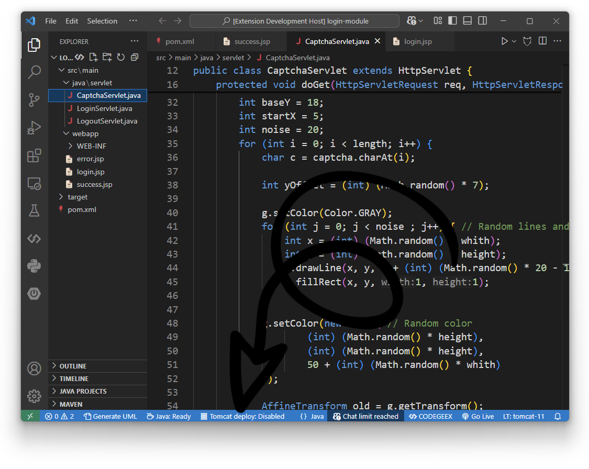

# Tomcat for VSCode [](https://github.com/Al-rimi/tomcat/actions)

Advanced Apache Tomcat management directly in your editor. Full server control, smart deployment, and browser integration.


## Features
- One-click Tomcat management
- Auto-deploy on save
- Cross-browser integration
- Built-in diagnostics
- Fast build strategies

## Installation

1. Open VS Code
2. Launch Extensions View (`Ctrl+Shift+X`)
3. Search for `Al-rimi.tomcat`
4. Click <kbd>Install</kbd>

command line:
```bash
code --install-extension Al-rimi.tomcat
```

## Usage
> The extension is Fully AUTOMATED to work out of the box. Simply open a Java EE project and start coding...

### Editor Button

#### Click to Deploy the current project


### Status Bar

#### Click to Change the default deploy mode


### Command Palette (`Ctrl+Shift+P`)

| Command                | Action                                           |
|------------------------|--------------------------------------------------|
| `Tomcat: Start`        | Launches Tomcat server                           |
| `Tomcat: Stop`         | Stops Tomcat server                              | 
| `Tomcat: Clean`        | Cleans Tomcat webapps, temp and work directories |
| `Tomcat: Deploy`       | Deploys current project                          | 
| `Tomcat: Help`         | Shows interactive help documentation             |

## Configuration

Access via <kbd>Ctrl+,</kbd> → Search "Tomcat"

| **Setting**                  | **Default**       | **Description**                                                                          |
|------------------------------|-------------------|------------------------------------------------------------------------------------------|
| `tomcat.defaultBuildType`    | `Fast`            | Default build strategy for deployments (`Fast`, `Maven`, `Gradle`)                       |
| `tomcat.defaultDeployMode`   | `Disabled`        | Auto-deploy triggers (`Disabled`, `On Save`, `On Shortcut`)                              |
| `tomcat.defaultBrowser`      | `Google Chrome`   | Browser for app launch & debug (`Google Chrome`, `Microsoft Edge`, `Firefox`, `Safari`, `Brave`, `Opera`) |
| `tomcat.loggingLevel`        | `WARN`            | Log verbosity level (`DEBUG`, `INFO`, `WARN`, `ERROR`, `SILENT`)                         |
| `tomcat.java.home`           | `JAVA_HOME`       | JDK installation path (e.g., `C:\Program Files\Java\jdk-21`)                             |
| `tomcat.home`                | `CATALINA_HOME`   | Tomcat installation directory (e.g., `C:\Java\apache-tomcat-11.0.4`)                     |
| `tomcat.port`                | `8080`            | Tomcat server listen port (valid range: `1024`-`65535`)                                  |
| `tomcat.webApps`             | `["ROOT", "docs", "examples", "manager", "host-manager"]`     | list of protected web apps during cleanup operations                |

## Requirements

- **Runtime**:
  - JDK 11+ (`JAVA_HOME` or `tomcat.java.home`)
  - Apache Tomcat 9+ (`CATALENA_HOME` or `tomcat.home`)
  
- **Build Tools** (optional):
  - `Maven` 3.6+ *or* `Gradle` 6.8+ (if using `Maven` or `Gradle` build types)

## Developer Documentation

For technical implementation details and contribution guidelines, see:
- [System Architecture](https://github.com/Al-rimi/tomcat/tree/main/docs/ARCHITECTURE.md)
- [Development Guide](https://github.com/Al-rimi/tomcat/tree/main/docs/DEVELOPMENT.md) 
- [Testing Strategy](https://github.com/Al-rimi/tomcat/tree/main/docs/TESTING.md)

## Known Issues

- Firefox and Safari will always open a new tab instead of reusing the existing one due to browser limitations.

[](https://github.com/Al-rimi/tomcat/issues)

## What's New in 2.0.2
- **Enterprise Architecture**: Complete OOP redesign with SOLID principles
- **Dynamic settings**: Auto detect and validate user settings
- **Browser Management**: Advanced WebSocket integration for Chromium browsers
- **Customizable Cleanup**: Web application protection during clean operations
- **Diagnostic Tools**: Integrated network analyzer and port scanner
- **Port Management**: Dynamic port allocation and release

[View Full Changelog](https://github.com/Al-rimi/tomcat/blob/main/CHANGELOG.md)

---

**License**: [MIT](LICENSE) • 💖 **Support**: Star our [GitHub Repo](https://github.com/Al-rimi/tomcat) • [VScode Marketplace](https://marketplace.visualstudio.com/items?itemName=Al-rimi.tomcat)