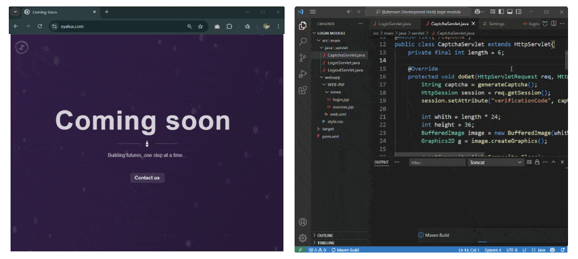
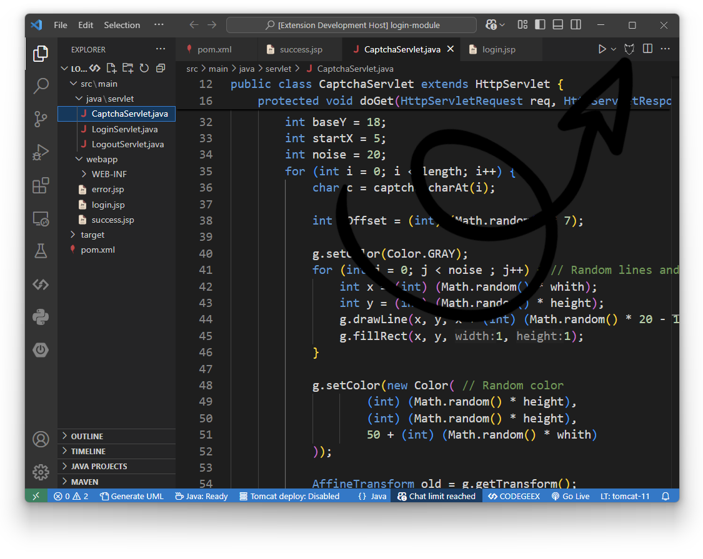
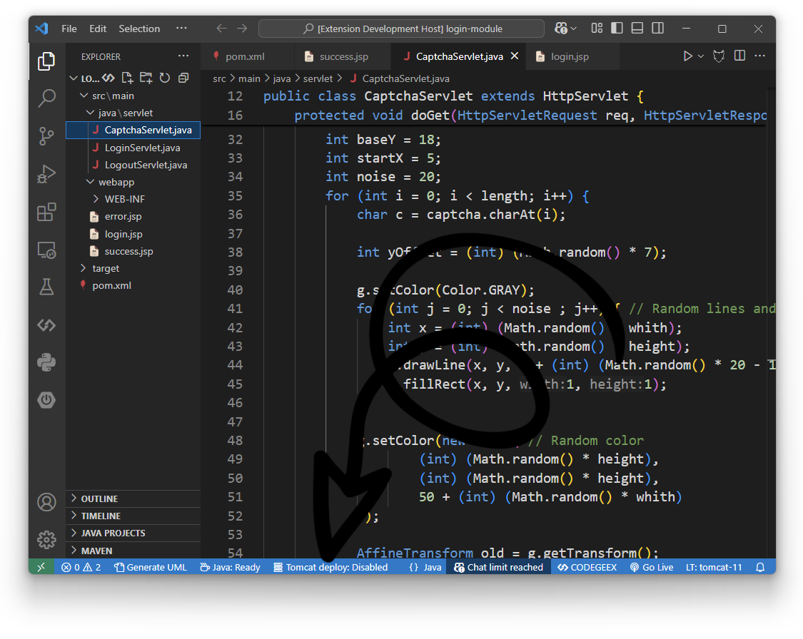

# Tomcat for VSCode [](https://marketplace.visualstudio.com/items?itemName=Al-rimi.tomcat) [](https://marketplace.visualstudio.com/items?itemName=Al-rimi.tomcat) [](https://marketplace.visualstudio.com/items?itemName=Al-rimi.tomcat) [](https://github.com/Al-rimi/tomcat/actions)

Advanced Apache Tomcat management. Full server control, smart deployment, browser integration and debugging support.



## Features

- **Full Server Logs Monitoring**
  Monitor all+ Tomcat logs in real-time with syntax highlighting

- **HTTP Traffic Monitoring**  
  Monitor Tomcat access logs dynamically with built-in syntax highlighting

- **Customizable Deployment Strategies**  
  Three build strategies with memory-optimized fast deployment (4× faster than Maven)

- **On-Save Deployment**  
  Automatically deploy your project every time you save a file — no manual steps needed.

- **Built-in Debugging**  
  Java-specific syntax coloring in output channel with organized error messages

- **Smart Resource Management**  
  Automatic process cleanup and EBUSY error recovery during deployments

- **Cross-Browser Automation**  
  Automate browser testing across multiple browsers seamlessly.

## Installation

1. Open VS Code  
2. Launch Extensions View (`Ctrl+Shift+X`)  
3. Search for `Al-rimi.tomcat`  
4. Click <kbd>Install</kbd>

Command line:
```bash
code --install-extension Al-rimi.tomcat
```

## Usage

> The `Editor Button` and `Status Bar` are only visible when the current project is detected as a Java EE project, following VScode [Editor Actions](https://code.visualstudio.com/api/ux-guidelines/editor-actions) and [Status Bar](https://code.visualstudio.com/api/ux-guidelines/status-bar) Guidelines.

<details>
<summary>When is a project considered a Java EE project? click to expand</summary>

```typescript
public static isJavaEEProject(): boolean {
    const workspaceFolders = vscode.workspace.workspaceFolders;

    // Check 0: Workspace must be open
    if (!workspaceFolders) {
        return false;
    }

    const rootPath = workspaceFolders[0].uri.fsPath;
    const webInfPath = path.join(rootPath, 'src', 'main', 'webapp', 'WEB-INF');

    // Check 1: Look for WEB-INF directory in the standard structure
    if (fs.existsSync(webInfPath)) {
        return true;
    }

    // Check 2: Check for presence of deployment descriptor (web.xml)
    if (fs.existsSync(path.join(webInfPath, 'web.xml'))) {
        return true;
    }

    const pomPath = path.join(rootPath, 'pom.xml');

    // Check 3: Look for WAR packaging in Maven project
    if (
        fs.existsSync(pomPath) &&
        fs.readFileSync(pomPath, 'utf-8').includes('<packaging>war</packaging>')
    ) {
        return true;
    }

    const gradlePath = path.join(rootPath, 'build.gradle');

    // Check 4: Look for Java EE-related keywords in Gradle config
    if (
        fs.existsSync(gradlePath) &&
        fs.readFileSync(gradlePath, 'utf-8').match(/(tomcat|jakarta|javax\.ee)/i)
    ) {
        return true;
    }

    const targetPath = path.join(rootPath, 'target');

    // Check 5: Look for compiled artifacts (.war or .ear) in target folder
    if (
        fs.existsSync(targetPath) &&
        fs.readdirSync(targetPath).some(file => file.endsWith('.war') || file.endsWith('.ear'))
    ) {
        return true;
    }

    // If none match, project is not considered a Java EE project
    return false;
}
```

[Method location](https://github.com/Al-rimi/tomcat/blob/main/src/utils/Builder.ts#L121-L159), If you notice any false positives/negatives or have better ideas for detection logic, you are more than welcome to contribute:

[](https://github.com/Al-rimi/tomcat/issues/new?title=Improve+Java+EE+Project+Detection+Logic)

---

</details>

###  Editor Button

Click the Tomcat icon in the editor title bar to deploy your project.



###  Status Bar

Click the Tomcat status in the bottom bar to toggle auto-deploy modes.



### Command Palette

Use the Command Palette (`Ctrl+Shift+P`) to quickly access core commands:

| Command                | Description                                         |
|------------------------|-----------------------------------------------------|
| `Tomcat: Start`        | Launch the Tomcat server                            |
| `Tomcat: Stop`         | Stop the running server                             |
| `Tomcat: Clean`        | Clean Tomcat `webapps`, `temp`, and `work` folders |
| `Tomcat: Deploy`       | Deploy the current Java EE project                 |
| `Tomcat: Help`         | Show the help documentation                        |

## Configuration

Access via <kbd>Ctrl+,</kbd> → Search "Tomcat"

| **Setting**                  | **Default**       | **Description**                                                                          |
|------------------------------|-------------------|------------------------------------------------------------------------------------------|
| `tomcat.autoDeployBuildType` | `Fast`            | Default build strategy for deployments (`Fast`, `Maven`, `Gradle`)                       |
| `tomcat.autoDeployMode`      | `Disabled`        | Auto-deploy triggers (`Disabled`, `On Save`, `On Shortcut`)                              |
| `tomcat.browser`             | `Google Chrome`   | Browser for app launch & debug (`Google Chrome`, `Microsoft Edge`, `Firefox`, `Safari`, `Brave`, `Opera`) |
| `tomcat.port`                | `8080`            | Tomcat server listen port (valid range: `1024`-`65535`)                                  |
| `tomcat.protectedWebApps`    | `["ROOT", "docs", "examples", "manager", "host-manager"]` | List of protected web apps during cleanup operations |
| `tomcat.logLevel`            | `INFO`            | Minimum log level to display (`DEBUG`, `INFO`, `SUCCESS`, `HTTP`, `APP`, `WARN`, `ERROR`) |
| `tomcat.showTimestamp`       | `true`            | Whether to include timestamps in log messages                                            |
| `tomcat.autoScrollOutput`    | `false`           | Automatically reveal output channel when new logs are added                              |

> `tomcat.home` and `tomcat.javaHome` are now auto-detected and hidden from user settings.

## Requirements

- **Runtime**:
  - JDK 11+
  - Apache Tomcat 9+
  
- **Build Tools** (optional):
  - `Maven` 3.6+ *or* `Gradle` 6.8+ (if using `Maven` or `Gradle` build types)

## Developer Documentation

For technical implementation details and contribution guidelines, see:
- [System Architecture](https://github.com/Al-rimi/tomcat/tree/main/docs/ARCHITECTURE.md)
- [Development Guide](https://github.com/Al-rimi/tomcat/tree/main/docs/DEVELOPMENT.md) 
- [Testing Strategy](https://github.com/Al-rimi/tomcat/tree/main/docs/TESTING.md)

## Known Issues

- Firefox and Safari will always open a new tab instead of reusing the existing one due to browser limitations.

[](https://github.com/Al-rimi/tomcat/issues)


## What's New in 2.5.0

- **Real-Time Server Insights**  
  Instant full server logging with dual-stream architecture for all server events (Thanks to @zhuxiaodics6)

- **Smart File Watching**  
  Hybrid filesystem watcher combines event-driven and polling strategies for reliable change detection

- **Performance Boost**  
  Memory-optimized log processing pipeline guarantees sub-100ms latency

- **Granular Log Control**  
  New `tomcat.logLevel` and `tomcat.showTimestamp` settings for customized logging

- **Reliable Log Rotation**  
  Enhanced date pattern matching for accurate log rotation detection

- **Cross-Platform Stability**  
  Fixed concurrent access during log rotation and improved multi-OS line ending handling

[View Full Changelog](https://github.com/Al-rimi/tomcat/blob/main/CHANGELOG.md)

---

**License**: [MIT](LICENSE) • 💖 **Support**: Star our [GitHub Repo](https://github.com/Al-rimi/tomcat) • [VScode Marketplace](https://marketplace.visualstudio.com/items?itemName=Al-rimi.tomcat)
