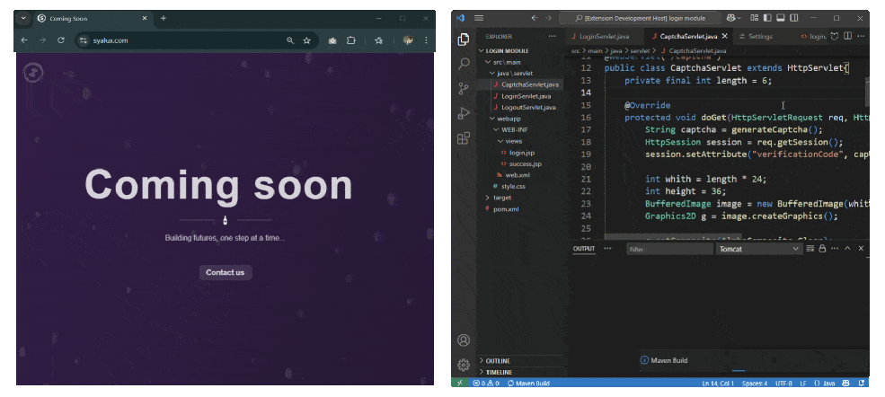
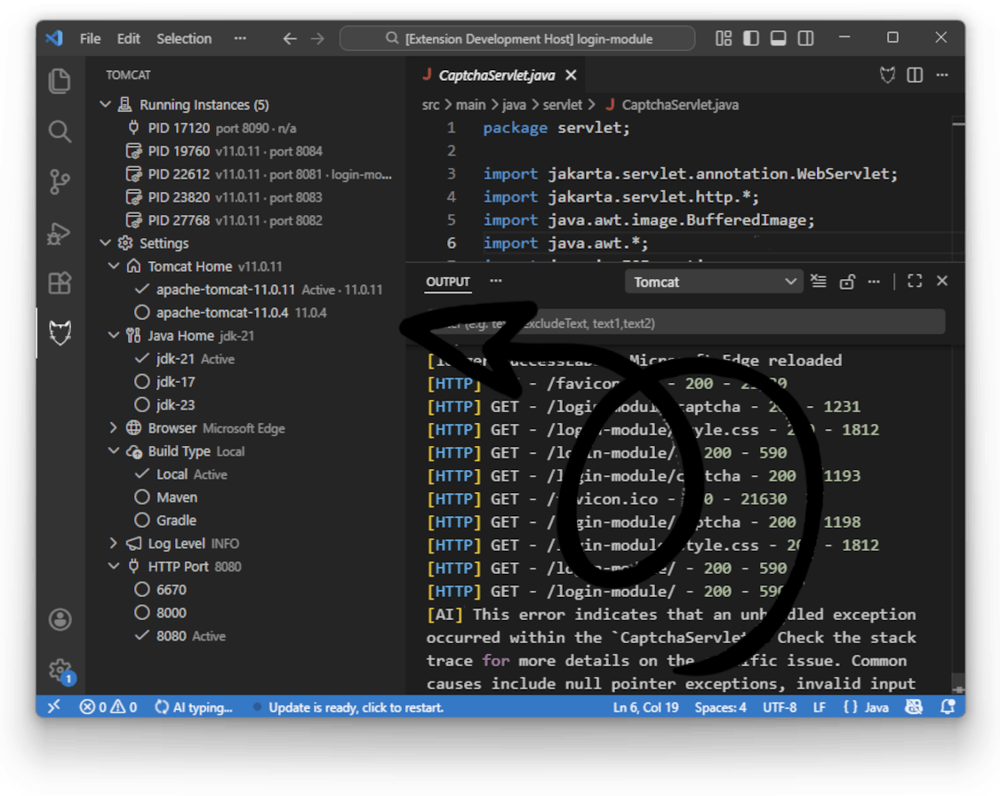
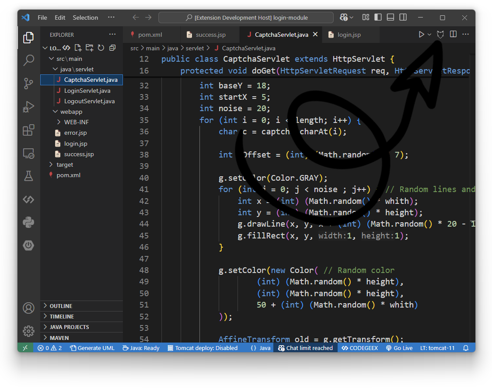
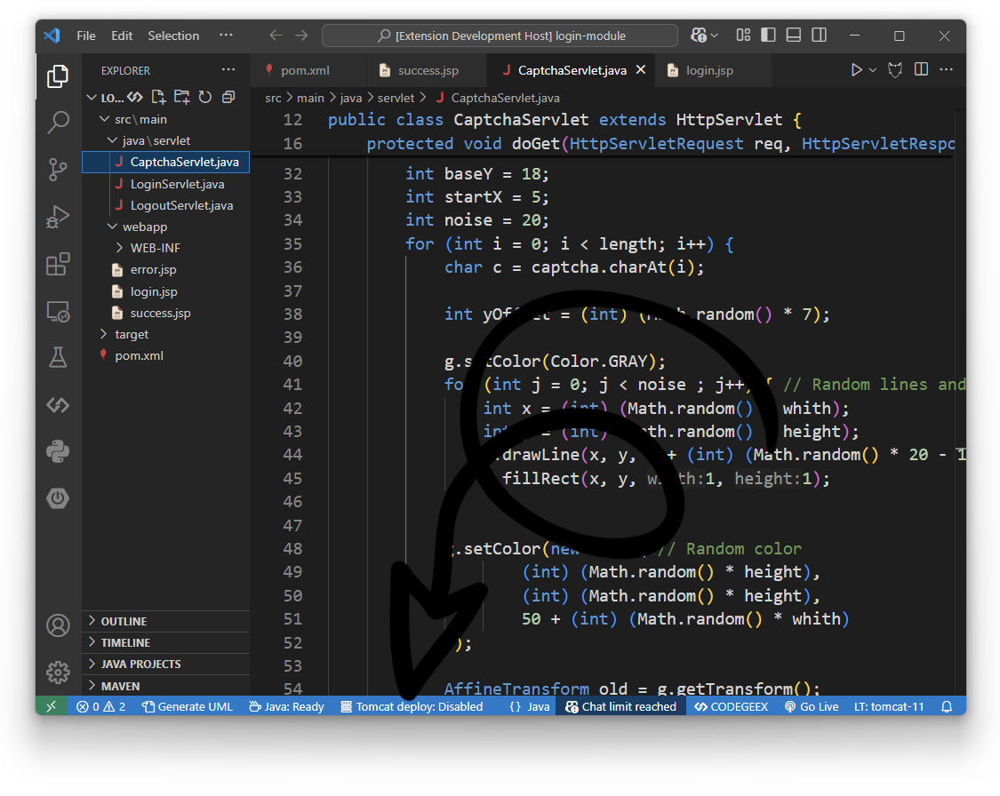

# Tomcat AI 部署助手（VS Code） [](https://marketplace.visualstudio.com/items?itemName=Al-rimi.tomcat) [](https://marketplace.visualstudio.com/items?itemName=Al-rimi.tomcat) [](https://marketplace.visualstudio.com/items?itemName=Al-rimi.tomcat) [](https://github.com/Al-rimi/tomcat/actions)

[English](README.md)

面向 VS Code 的 AI 驱动 Tomcat 管理：流式日志解释、一键部署、浏览器自动刷新。




## 功能特性

- **全量服务器日志监控**  
  实时查看全部 Tomcat 日志，带语法高亮。

- **Java Web 应用支持**  
  检测并管理 Java EE/Tomcat Web 应用，支持多根工作区应用发现和部署。

- **多种构建策略**  
  提供 Local、Maven、Gradle 三种部署方式。

- **AI 解释（流式）**  
  WARN/ERROR 日志自动送至已配置的 AI 提供商，支持流式输出、在本地端点不可达时的回退策略，并自动跳转到出错文件/行。

- **保存/Ctrl+S 部署**
  每次保存（或 Ctrl+S/Cmd+S）自动部署项目。

- **内置调试**  
  输出通道具备 Java 专属语法着色与结构化错误提示。

- **浏览器自动化**  
  多浏览器自动打开/刷新。

- **本地化 UI（中英双语）**  
  命令、状态栏文案和提示已本地化，新增语言切换并在首次运行时自动跟随 VS Code 语言。

- **多项目工作区感知**  
  检测同一工作区中的多个项目，并处理每个文件夹的 Web 应用部署和工作区设置。

- **实例管理 UI 和设置窗口**  
  在一个地方管理所有 Tomcat 实例：启动、停止、终止、刷新、在浏览器中打开，并从统一视图配置 Tomcat/Java 路径和 HTTP 端口。

## 安装

1. 打开 VS Code  
2. 进入扩展视图（`Ctrl+Shift+X`）  
3. 搜索 `Al-rimi.tomcat`  
4. 点击 <kbd>Install</kbd>

命令行：
```bash
code --install-extension Al-rimi.tomcat
```

## 使用

> 仅当当前项目被识别为 Java EE 项目时，才会显示“编辑器按钮”和“状态栏”入口（遵循 VS Code 编辑器操作与状态栏规范）。

<details>
<summary>何时被判定为 Java EE 项目？点击展开</summary>

```typescript
public static isJavaEEProject(): boolean {
		const workspaceFolders = vscode.workspace.workspaceFolders;

		if (!workspaceFolders) {
				return false;
		}

		const rootPath = workspaceFolders[0].uri.fsPath;
		const webInfPath = path.join(rootPath, 'src', 'main', 'webapp', 'WEB-INF');

		if (fs.existsSync(webInfPath)) {
				return true;
		}

		if (fs.existsSync(path.join(webInfPath, 'web.xml'))) {
				return true;
		}

		const pomPath = path.join(rootPath, 'pom.xml');

		if (
				fs.existsSync(pomPath) &&
				fs.readFileSync(pomPath, 'utf-8').includes('<packaging>war</packaging>')
		) {
				return true;
		}

		const gradlePath = path.join(rootPath, 'build.gradle');

		if (
				fs.existsSync(gradlePath) &&
				fs.readFileSync(gradlePath, 'utf-8').match(/(tomcat|jakarta|javax\.ee)/i)
		) {
				return true;
		}

		const targetPath = path.join(rootPath, 'target');

		if (
				fs.existsSync(targetPath) &&
				fs.readdirSync(targetPath).some(file => file.endsWith('.war') || file.endsWith('.ear'))
		) {
				return true;
		}

		return false;
}
```

[方法位置](src/services/Builder.ts#L121-L159)。如有误报/漏报或更好的检测思路，欢迎贡献：

[](https://github.com/Al-rimi/tomcat/issues/new?title=Improve+Java+EE+Project+Detection+Logic)

---

</details>


###  实例与应用视图

实例与应用视图是实例和应用的统一管理中心。它实时展示所有运行中和已保存的 Tomcat 实例，并在树中显示应用项，支持一键部署、运行、刷新和删除。

你可以：
- 启动/停止/终止 Tomcat 实例
- 管理 Tomcat/Java 路径、HTTP 端口和实例级设置
- 通过 `+` 操作创建新应用并生成脚手架模板
- 一键部署和运行应用
- 删除已部署应用并清理项目产物
- 在浏览器中打开已部署应用，查看 PID/端口/版本/工作区

所有操作均可在一个视图中完成，树和右键菜单提供快捷操作，极大提升工作流效率。



###  编辑器按钮

点击编辑器标题栏中的 Tomcat 图标即可部署项目。



###  状态栏

点击底部状态栏的 Tomcat 状态切换自动部署模式。



### 命令面板

在命令面板（`Ctrl+Shift+P`）快速访问核心命令：

| 命令                    | 描述                                               |
|------------------------|----------------------------------------------------|
| `Tomcat: 启动`        | 启动 Tomcat 服务器                                  |
| `Tomcat: 停止`         | 停止正在运行的服务器                                |
| `Tomcat: 清理`        | 清理 Tomcat `webapps`、`temp`、`work` 目录          |
| `Tomcat: 部署`       | 部署当前 Java EE 项目                               |
| `Tomcat: 刷新实例列表` | 刷新所有运行和已保存 Tomcat 实例的列表 |
| `Tomcat: 终止实例`     | 强制终止选中的 Tomcat 实例            |
| `Tomcat: 在浏览器中打开`   | 在浏览器中打开实例已部署的应用         |
| `Tomcat: 新建实例`      | 启动一个新的 Tomcat 实例               |
| `Tomcat: 配置字段`   | 编辑实例的 Tomcat Home、Java Home、端口或浏览器 |
| `Tomcat: 添加 Tomcat 路径`   | 添加新的 Tomcat 安装路径               |
| `Tomcat: 移除 Tomcat 路径`| 移除已保存的 Tomcat 安装路径           |
| `Tomcat: 刷新版本`  | 刷新可用的 Tomcat 版本                 |
| `Tomcat: 设为当前 Tomcat`   | 设为当前激活的 Tomcat Home             |
| `Tomcat: 添加 Java 路径`     | 添加新的 Java 安装路径                 |
| `Tomcat: 移除 Java 路径`  | 移除已保存的 Java 安装路径             |
| `Tomcat: 设为当前 Java`     | 设为当前激活的 Java Home               |
| `Tomcat: 设置 HTTP 端口`     | 更改实例的 HTTP 端口                   |
| `Tomcat: 添加 HTTP 端口`     | 向快捷选择列表添加新的 HTTP 端口        |
| `Tomcat: 移除 HTTP 端口`  | 移除已保存的 HTTP 端口                 |
| `Tomcat: 设置构建类型`    | 更改实例的构建策略                     |
| `Tomcat: 设置日志级别`     | 更改实例的日志级别                     |
| `Tomcat: 创建应用`        | 通过模板快速生成新的 Web 应用                         |
| `Tomcat: 刷新应用列表`      | 刷新树视图中的应用列表                               |

## 配置

在 <kbd>Ctrl+,</kbd> 中搜索 “Tomcat” 即可配置：

| **设置项**                    | **默认值**        | **说明**                                                                                |
|------------------------------|-------------------|------------------------------------------------------------------------------------------|
| `tomcat.language`            | `auto`            | 扩展界面语言（`auto`、`en`、`zh-CN`），首次运行 `auto` 将跟随 VS Code 显示语言。            |
| `tomcat.buildType`           | `Local`           | 默认部署策略（`Local`、`Maven`、`Gradle`）                                                |
| `tomcat.autoDeployMode`      | `Disable`         | 自动部署触发方式（`Disable`、`On Save`、`On Shortcut`）                                   |
| `tomcat.browser`             | `Google Chrome`   | 浏览器自动打开/调试（`Disable`、`Google Chrome`、`Microsoft Edge`、`Firefox`、`Safari`、`Brave`、`Opera`） |
| `tomcat.port`                | `8080`            | Tomcat 监听端口（有效范围：`1024`-`49151`）                                               |
| `tomcat.ports`               | `[]`              | 常用 HTTP 端口列表，便于快速选择（数字数组，按工作区保存）                                 |
| `tomcat.homes`               | `[]`              | 多版本 Tomcat 安装路径列表，用于管理多个 Tomcat 版本                                      |
| `tomcat.javaHomes`           | `[]`              | 已配置的 Java Home 列表（字符串数组）；`tomcat.javaHome` 为当前激活项                        |
| `tomcat.base`                | ``                | CATALINA_BASE 路径（conf/webapps/logs）；未设置时默认使用 `tomcat.home`                     |
| `tomcat.protectedWebApps`    | `['ROOT', 'docs', 'examples', 'manager', 'host-manager']` | 清理时保留的应用列表 |
| `tomcat.logLevel`            | `INFO`            | 最低日志级别（`DEBUG`、`INFO`、`SUCCESS`、`HTTP`、`APP`、`WARN`、`ERROR`）                 |
| `tomcat.showTimestamp`       | `true`            | 是否在日志中显示时间戳                                                                   |
| `tomcat.autoReloadBrowser`   | `true`            | 部署后自动刷新浏览器；如遇问题可关闭                                                     |
| `tomcat.logEncoding`         | `utf8`            | 日志编码（`utf8`、`ascii`、`utf-8`、`utf16le`、`utf-16le`、`ucs2`、`ucs-2`、`base64`、`base64url`、`latin1`、`binary`、`hex`） |
| `tomcat.ai.provider`         | `none`           | AI 提供商（`none`、`local`、`aliyun-dashscope`、`baichuan`、`zhipu`、`deepseek`、`custom`） |
| `tomcat.ai.endpoint`         | `http://127.0.0.1:11434/api/chat` | AI 聊天/补全接口地址 |
| `tomcat.ai.model`            | `qwen2.5:7b`      | 发送给 AI 的模型标识                                                                      |
| `tomcat.ai.apiKey`           | ``                | 托管提供商的可选 Bearer Token                                                             |
| `tomcat.ai.localStartCommand`| `ollama serve`    | 当本地端点不可达时，用于启动本地 AI 服务的命令                                            |

> `tomcat.home` 和 `tomcat.javaHome` 已自动检测并从设置中隐藏。  
> WARN/ERROR 日志自动触发 AI 解释；仅当端点是 localhost 且不可达时才自动尝试启动本地 AI。

## 环境要求

- **运行时**：
	- JDK 11+
	- Apache Tomcat 9+
  
- **构建工具**（可选）：
	- `Maven` 3.6+ *或* `Gradle` 6.8+（当选择对应构建类型时）

## 开发者文档

技术实现与贡献指南：
- [系统架构](https://github.com/Al-rimi/tomcat/tree/main/docs/ARCHITECTURE.md)
- [开发指南](https://github.com/Al-rimi/tomcat/tree/main/docs/DEVELOPMENT.md)
- [测试策略](https://github.com/Al-rimi/tomcat/tree/main/docs/TESTING.md)

## 已知问题

- **浏览器自动刷新兼容性**  
	<details>
	<summary>部分浏览器可能不支持自动刷新（点击展开）</summary>

	扩展使用 Chrome Debug Protocol（CDP）在部署后刷新页面，当前支持：
	- Google Chrome
	- Microsoft Edge
	- Brave
	- Opera

	**不支持**：
	- Firefox
	- Safari
  
	以上浏览器缺少 CDP，无法自动刷新。
	</details>

- **调试模式启动失败**  
	<details>
	<summary>在某些系统配置下浏览器调试模式可能启动失败（点击展开）</summary>

	扩展使用的命令模板：
	```bash
	start chrome.exe --remote-debugging-port=9222 http://localhost:8080/app-name
	```
	**常见解决方案**：
	1. 确认浏览器可执行文件已在 PATH 中
	2. 确认端口 9222 未被占用
	3. 升级浏览器到最新版本

	如问题仍在，可关闭设置 `tomcat.autoReloadBrowser`。
	</details>

[](https://github.com/Al-rimi/tomcat/issues/new)  
[](https://github.com/Al-rimi/tomcat/pulls)


## 4.2.0 更新要点

本次发布聚焦多应用场景的可靠性与可用性：更安全的实例管理、更智能的部署流程，以及更清晰的 AI 集成体验。

- 更好的上下文与持久化：输出中包含应用+端口信息，扩展启动时能可靠恢复已保存的实例映射。
- 更安全的实例控制：按实例停止/终止避免了全局结束，扩展会复用已有实例以防重复启动。
- 更智能的部署：Builder 会合并重复部署请求，自动重启最新部署，并修复自动部署触发的边缘问题。
- AI 使用体验提升：AI 设置在树视图中更直观（展示 provider/model），布尔切换可内联操作，减少了流复制问题。
- 日志更清晰：进程退出日志包含实例上下文，Tomcat 启动信息降为 DEBUG 以减少噪音。

[查看完整更新日志](https://github.com/Al-rimi/tomcat/blob/main/CHANGELOG.md)

---

**许可证**： [MIT](LICENSE) • 💖 **支持**：给我们的 [GitHub 仓库](https://github.com/Al-rimi/tomcat) 加星 • [VS Code 市场](https://marketplace.visualstudio.com/items?itemName=Al-rimi.tomcat)
