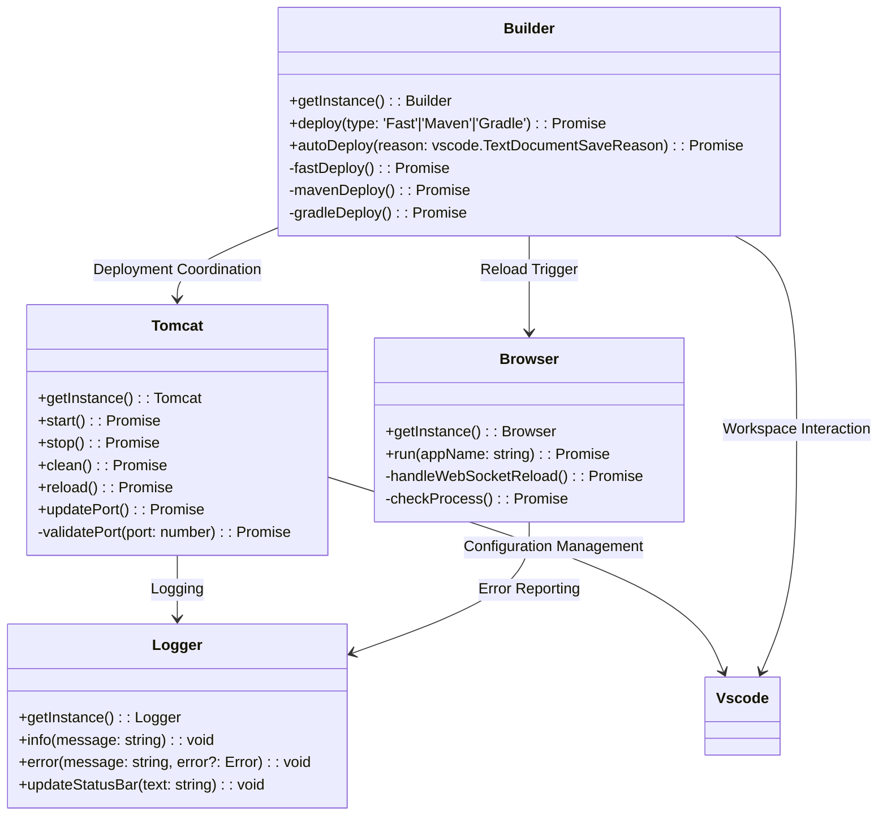

# Tomcat Extension Architecture

## Core Component Structure

## Component Responsibilities

### 1. Tomcat Manager
- **Server Lifecycle**: Start/stop using catalina.sh/bat scripts with proper JAVA_HOME
- **Port Management**: Validate port range (1024-49151), update server.xml connector
- **Environment Detection**: Locate CATALINA_HOME and JAVA_HOME through config or user input
- **Clean Operations**: Remove non-essential webapps while preserving ROOT/docs/examples
- **Security Integration**: Auto-add admin user to tomcat-users.xml for manager access
- **Health Checks**: Verify running status through port scanning and netstat commands

### 2. Deployment Builder
- **Build Strategies**:
  - *Fast*: Direct file copy with JSP/Java compilation using system javac
  - *Maven*: Execute mvn clean package and deploy WAR artifacts
  - *Gradle*: Run gradle war task with project-specific configuration
- **Project Detection**: Identify JavaEE projects through WEB-INF, Maven POM, or Gradle files
- **Auto-Deploy**: Trigger deployments on save (Ctrl+S/Cmd+S) based on configuration
- **Project Scaffolding**: Create new Maven webapp projects using archetype-webapp

### 3. Browser Controller
- **Cross-Platform Support**: Windows/Mac/Linux command variants for Chrome, Edge, Firefox
- **Debug Protocol**: WebSocket integration for page reload without full browser restart
- **Process Management**: Detect running instances, kill hung processes on deployment
- **Smart Reload**: Maintain existing browser sessions when possible
- **Fallback Handling**: Default to Chrome when unsupported browsers are selected

### 4. Logging System
- **Multi-Channel Output**: VSCode output channel + status bar + toast notifications
- **Configurable Levels**: DEBUG < INFO < WARN < ERROR < SILENT
- **Status Visualization**: Animated icons for active deployments
- **Error Handling**: Stack traces in output channel with user-friendly messages
