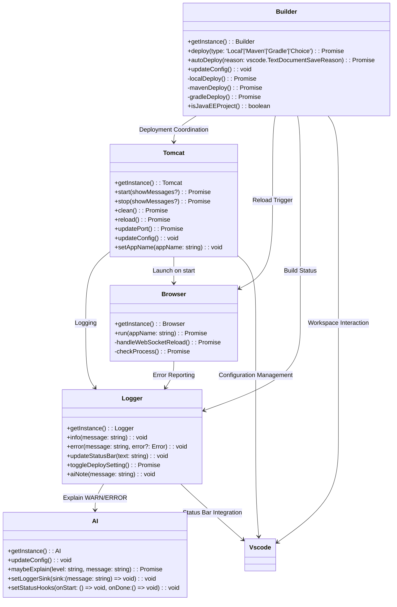
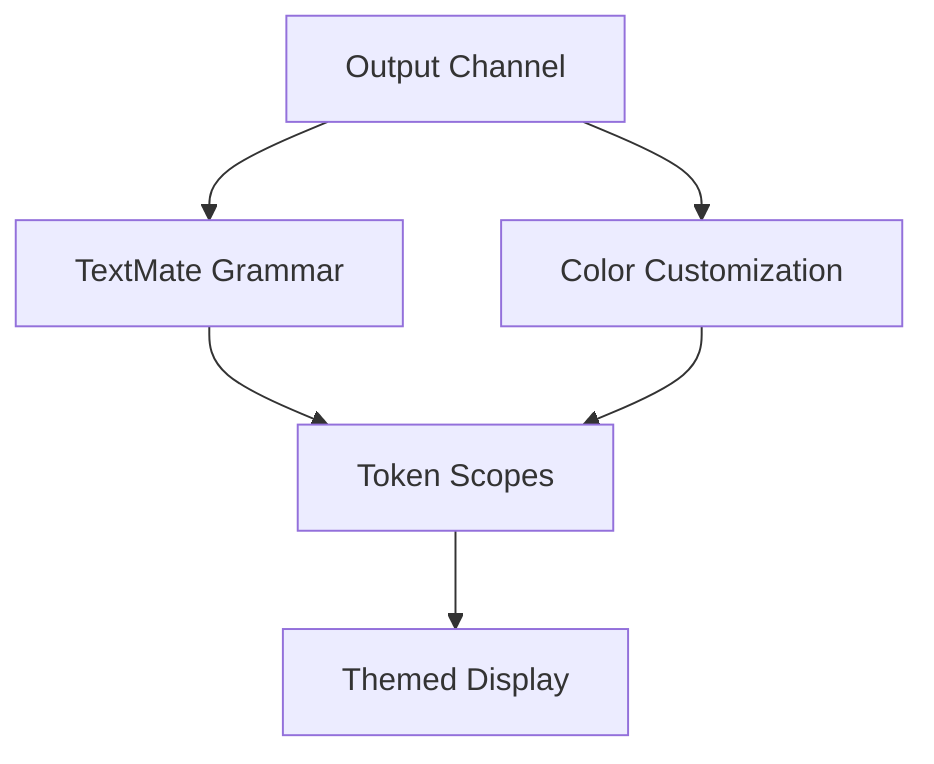

# Tomcat Extension Architecture

## Core Component Structure


```mermaid
classDiagram
    class Tomcat {
      +getInstance(): Tomcat
      +start(showMessages?): Promise<void>
      +stop(showMessages?): Promise<void>
      +clean(): Promise<void>
      +reload(): Promise<void>
      +updatePort(): Promise<void>
      +updateConfig(): void
      +setAppName(appName: string): void
    }
    
    class Builder {
      +getInstance(): Builder
      +deploy(type: 'Local'|'Maven'|'Gradle'|'Choice'): Promise<void>
      +autoDeploy(reason: vscode.TextDocumentSaveReason): Promise<void>
      +updateConfig(): void
      -localDeploy(): Promise<void>
      -mavenDeploy(): Promise<void>
      -gradleDeploy(): Promise<void>
      +isJavaEEProject(): boolean
    }
    
    class Browser {
        +getInstance(): Browser
        +run(appName: string): Promise<void>
        -handleWebSocketReload(): Promise<void>
        -checkProcess(): Promise<boolean>
    }
    
    class Logger {
        +getInstance(): Logger
        +info(message: string): void
        +error(message: string, error?: Error): void
        +updateStatusBar(text: string): void
        +toggleDeploySetting(): Promise<void>
        +aiNote(message: string): void
      }

      class AI {
        +getInstance(): AI
        +updateConfig(): void
        +maybeExplain(level: string, message: string): Promise<void>
        +setLoggerSink(sink: (message: string) => void): void
        +setStatusHooks(onStart: () => void, onDone: () => void): void
    }
    
    class Vscode
    
    Tomcat --> Logger : Logging
      Tomcat --> Browser : Launch on start
    Builder --> Tomcat : Deployment Coordination
    Builder --> Browser : Reload Trigger
    Builder --> Logger : Build Status
    Browser --> Logger : Error Reporting
      Logger --> AI : Explain WARN/ERROR
    Tomcat --> Vscode : Configuration Management
    Builder --> Vscode : Workspace Interaction
    Logger --> Vscode : Status Bar Integration
```

## Component Responsibilities

### 1. Tomcat Manager
- **Server Lifecycle**: Start/stop using catalina scripts with resolved JAVA_HOME and CATALINA_HOME ([src/services/Tomcat.ts](src/services/Tomcat.ts))
- **Port Management**: Validate port range (1024-49151) and update server.xml connector ([src/services/Tomcat.ts](src/services/Tomcat.ts))
- **Environment Detection**: Locate CATALINA_HOME and JAVA_HOME via config/env or user prompt ([src/services/Tomcat.ts](src/services/Tomcat.ts))
- **Clean Operations**: Remove non-essential webapps while preserving ROOT/docs/examples
- **Health Checks**: Verify running status through port scanning and netstat
- **User Management**: Auto-add admin user to tomcat-users.xml for manager access when needed

### 2. Deployment Builder
- **Build Strategies**:
  - *Local*: Directly syncs webapp resources and compiles Java sources into `WEB-INF/classes` ([src/services/Builder.ts](src/services/Builder.ts))
  - *Maven*: Executes `mvn clean package` with parsed errors ([src/services/Builder.ts](src/services/Builder.ts))
  - *Gradle*: Runs `gradle war` style deployment with project-specific configuration ([src/services/Builder.ts](src/services/Builder.ts))
- **Project Detection**: Identify Java EE projects via WEB-INF, WAR packaging, Gradle markers, or built artifacts ([src/services/Builder.ts](src/services/Builder.ts))
- **Auto-Deploy**: Trigger deployments on save (Ctrl+S/Cmd+S) based on configuration [View Code](https://github.com/Al-rimi/tomcat/blob/main/src/utils/Builder.ts#L247-L274)
- **Project Scaffolding**: Create new Maven webapp projects using archetype-webapp [View Code](https://github.com/Al-rimi/tomcat/blob/main/src/utils/Builder.ts#L276-L326)
- **Build Duration**: Logs and reports build completion time for performance tracking

### 3. Browser Controller
- **Cross-Platform Support**: Windows/Mac/Linux command variants for Chrome, Edge, Opera, Brave, Firefox, and Safari
- **Debug Protocol**: WebSocket integration for page reload without full browser restart [View Code](https://github.com/Al-rimi/tomcat/blob/main/src/utils/Browser.ts#L286-L334)
- **Process Management**: Detect running instances, kill hung processes on deployment
- **Smart Reload**: Maintain existing browser sessions when possible
- **Supported Browsers**:
  | Browser        | CDP Support | Auto-Reload | Process Management |
  |----------------|-------------|-------------|--------------------|
  | Chrome         | ✓           | ✓           | Advanced           |
  | Edge           | ✓           | ✓           | Advanced           |
  | Opera          | ✓           | ✓           | Advanced           |
  | Brave          | ✓           | ✓           | Advanced           |
  | Firefox        | Limited     | ✗           | Basic              |
  | Safari         | ✗           | ✗           | Basic              |

### 4. Logging System
- **Initializeation**: Editor button and status bar toggle for enabling/disabling auto-deploy [View Code](https://github.com/Al-rimi/tomcat/blob/main/src/utils/Logger.ts#L220-L244)
- **Multi-Channel Output**: VSCode output channel + status bar + toast notifications
- **Status Visualization**: Animated icons for active deployments
- **Error Handling**: Organized error messages for Java debugging and compilation with inline diagnostics and jump-to-file/line
- **AI Streaming**: Streams WARN/ERROR explanations into the Tomcat channel with "AI typing" status bar feedback
- **Syntax Coloring**: Enhanced output channel with Java-specific syntax highlighting
- **Toggle auto deploy**: Enable/disable auto-deploy on button click [View Code](https://github.com/Al-rimi/tomcat/blob/main/src/utils/Logger.ts#L199-L218)

### 5. AI Service
- **Class**: `AI` ([src/services/AI.ts](src/services/AI.ts))
- **Streaming Output**: Emits start/chunk/end events that Logger renders as live-typed responses.
- **Auto Explain**: Always-on for WARN/ERROR logs; capped prompt size and trimmed responses.
- **Local-First Startup**: Auto-starts local AI (e.g., Ollama) only when provider is `local` and endpoint is localhost, with hidden background spawn.
- **Resilience**: Falls back to non-streaming requests if streaming is unsupported.

#### Syntax Coloring Implementation

**Architecture**:

```mermaid
graph TD
    A[Output Channel] --> B[TextMate Grammar]
    A --> C[Color Customization]
    B --> D[Token Scopes]
    C --> D
    D --> E[Themed Display]
```

**Implementation Strategy**:

1. **Grammar Definition**:
   - Uses TextMate grammar format for tokenization
   - Custom scope name `source.tomcat-log`
   - Pattern matching for:
     - Timestamps `[01/01/2024, 12:00 PM]`
     - Log levels (INFO/DEBUG/ERROR)
     - Java file paths (`*.java`, `*.jsp`)
     - Build durations (`123ms`)
     - Error indicators (`^~~~` patterns)
     - Java syntax elements (classes, methods, annotations) [View Grammar](https://github.com/Al-rimi/tomcat/blob/main/syntaxes/tomcat-log.tmLanguage.json)

2. **Color Customization**:
   - Non-destructive merge with user themes
   - Semantic scope mapping [View Code](https://github.com/Al-rimi/tomcat/blob/main/src/ui/syntax.ts)
   - Theme-aware color selection:
     - 6 log level categories
     - 12 Java syntax types
     - 4 error severity levels

**Activation Flow**:
1. Extension registers `tomcat-log` grammar
2. Logger initializes output channel
3. `addSyntaxColoringRules()` merges customizations:
   ```typescript
   config.update('editor.tokenColorCustomizations', 
     { textMateRules: mergedRules },
     vscode.ConfigurationTarget.Global
   );
   ```
4. VS Code renderer applies scoped styles

**Key Features**:
- Preserves user theme settings through non-destructive merging
- Supports dark/light theme variants automatically
- Highlights build errors with red underline markers
- Differentiates Java types from framework classes
- Shows live deployment durations in green
- Formats XML config paths with italic style

**Integration Points**:
- Extends VS Code's output channel rendering
- Works with all built-in color themes
- Compatible with semantic highlighting API
- Exposes customization points through `contributes.grammars`