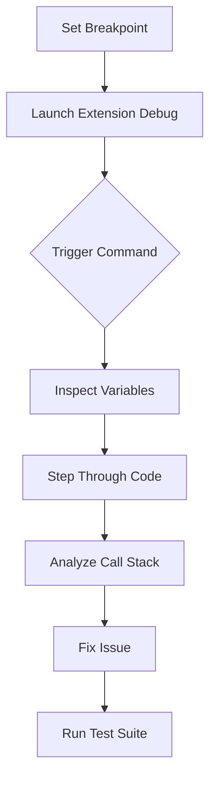

# Development Guide

## Environment Setup
1. **Prerequisites**:
   ```bash
   nvm install 18
   npm install -g vsce yo generator-code
   ```

2. **Clone & Build**:
   ```bash
   git clone https://github.com/Al-rimi/tomcat.git
   cd tomcat
   npm install
   npm run compile
   ```

## Code Structure

```bash
src/
├── core/
│   └── extension.ts          # Extension entry point
├── services/                 # Core services
│   ├── Tomcat.ts             # Server management core
│   ├── Builder.ts            # Deployment pipelines (Local/Maven/Gradle)
│   ├── Browser.ts            # Browser integration and CDP reloads
│   ├── Logger.ts             # Logging and status bar
│   ├── AI.ts                 # AI explain service (streaming, pinging, fallback)
│   └── View.ts               # Tree data provider + instance/app management
├── components/              # TreeView node classes
│   ├── InstanceItem.ts
│   ├── AppItem.ts
│   ├── ... (other node components)
└── utils/
    ├── i18n.ts              # Localized UI strings and translation helpers
    └── syntax.ts            # Token color customization rules

test/
└── suite/                    # Test cases
    ├── tomcat.test.ts        # Server tests
    ├── builder.test.ts       # Deployment tests
    ├── logger.test.ts        # Logging tests
    └── browser.test.ts       # Browser tests
```

## Key Implementation Patterns

1. **Singleton Services**:
```typescript
// Centralized service management with improved error handling
export class Tomcat {
    private static instance: Tomcat;
    public static getInstance(): Tomcat {
        if (!Tomcat.instance) {
            Tomcat.instance = new Tomcat();
        }
        return Tomcat.instance;
    }
}
```

2. **Strategy Pattern (Deployment)**:
```typescript
// Build type selection for deployments
const action = {
    'Local': () => this.localDeploy(projectDir, targetDir, tomcatHome),
    'Maven': () => this.mavenDeploy(projectDir, targetDir),
    'Gradle': () => this.gradleDeploy(projectDir, targetDir, appName)
}[type];
```

3. **Observer Pattern (Config Changes)**:
```typescript
// Reactive configuration updates with error logging
vscode.workspace.onDidChangeConfiguration(async (event) => {
    if (event.affectsConfiguration('tomcat.port')) {
        try {
            await Tomcat.getInstance().updatePort();
        } catch (err) {
            Logger.getInstance().error('Port update failed', err);
        }
    }
});
```

4. **Factory Pattern (Browser Commands)**:
```typescript
// Platform-specific command generation with debug args
private getBrowserCommand(browser: string, url: string): string | null {
    const platform = process.platform as 'win32'|'darwin'|'linux';
    const browserCommands = Browser.COMMANDS[browser]?.[platform];
    if (!browserCommands) return null;
    const debugArgs = '--remote-debugging-port=9222';
    return `${browserCommands.join(' ')} ${debugArgs} ${url}`;
}
```

5. **Streaming AI Output (Logger + AI)**:
```typescript
// AI service emits start/chunk/end events; Logger streams them into the output channel.
this.logSink?.('AI_STREAM_START:');
this.logSink?.(`AI_STREAM_CHUNK:${content}`);
this.logSink?.('AI_STREAM_END');
```
Status bar hooks (`showAIStatus`/`clearAIStatus`) are triggered around the streaming lifecycle.

## Extension Activation

```typescript
// extension.ts - Refactored activation sequence
export function activate(context: vscode.ExtensionContext) {
    // Initialize UI components first
    addSyntaxColoringRules();
    
    // Register command handlers with improved error context
    context.subscriptions.push(
        vscode.commands.registerCommand('tomcat.start', () => {
            Logger.getInstance().info('Starting Tomcat server');
            Tomcat.getInstance().start().catch(err => 
                Logger.getInstance().error('Start failed', err));
        }),
        vscode.commands.registerCommand('tomcat.deploy', () => {
            Logger.getInstance().info('Initiating deployment');
            Builder.getInstance().deploy('Choice').catch(err => 
                Logger.getInstance().error('Deployment failed', err));
        })
    );
    
    // Setup auto-deploy listeners with build duration tracking
    if (Builder.isJavaEEProject()) {
        context.subscriptions.push(
            vscode.workspace.onWillSaveTextDocument((e) => {
                const startTime = Date.now();
                Builder.getInstance().autoDeploy(e.reason)
                    .then(() => Logger.getInstance().info(`Build completed in ${Date.now() - startTime}ms`))
                    .catch(err => Logger.getInstance().error('Auto-deploy failed', err));
            })
        );
    }
}
```

## Build Process

```bash
# Install dependencies
npm install --legacy-peer-deps

# Compile TypeScript with production optimizations
npm run compile

# Run tests with focused builder tests
npm test -- --grep 'Builder Tests' --color --parallel=false

# Package extension with VS Code CLI
vsce package
```

## Release Process
1. **Version Bumping**:
   ```bash
   npm version patch|minor|major
   ```

2. **Quality Gates**:
   - All tests pass (unit, integration, E2E)
   - Code coverage ≥ 90%
   - Vulnerability scan clean
   - Documentation updated

3. **Publishing**:
   ```bash
   vsce package
   vsce publish -p $VSCE_TOKEN
   ```

## Debugging Workflow


## Testing Requirements
- **Coverage Targets**:
  | Component         | Line Coverage | Branch Coverage  |
  |-------------------|---------------|------------------|
  | Tomcat Manager    | 95%           | 90%              |
  | Deployment Engine | 92%           | 85%              |
  | Browser Control   | 88%           | 80%              |
