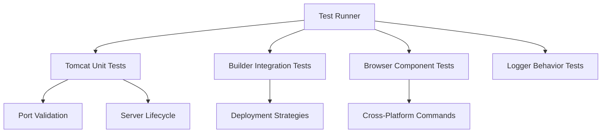

# Testing Protocol

## Test Architecture



## Core Test Cases

### 1. Tomcat Manager
```typescript
// Port validation
test('Reject invalid ports', async () => {
    await expect(tomcat.validatePort(1000))
        .rejects.toThrow('admin privileges');
    await expect(tomcat.validatePort(70000))
        .rejects.toThrow('Maximum allowed');
});

// Configuration persistence
test('Remember CATALINA_HOME', async () => {
    mockShowDialog.resolves([vscode.Uri.file('/fake/tomcat')]);
    await tomcat.findTomcatHome();
    expect(config.get('tomcat.home')).toEqual('/fake/tomcat');
});
```

### 2. Deployment Builder
```typescript
// Maven deployment
test('Build WAR with Maven', async () => {
    mockExistsSync.withArgs('pom.xml').returns(true);
    await builder.deploy('Maven');
    expect(execStub).toHaveBeenCalledWith('mvn clean package');
});

// Project detection
test('Identify JavaEE projects', () => {
    mockExistsSync.withArgs('WEB-INF/web.xml').returns(true);
    expect(Builder.isJavaEEProject()).toBeTruthy();
});
```

### 3. Browser Controller
```typescript
// Windows Chrome command
test('Generate Windows command', () => {
    mockPlatform('win32');
    expect(browser.getBrowserCommand('Chrome', 'http://test'))
        .toMatch('start chrome.exe --remote-debugging-port');
});

// Process detection
test('Check running Edge', async () => {
    mockPlatform('darwin');
    mockExec('pgrep -x "Microsoft Edge"', '1234');
    expect(await browser.checkProcess('Edge')).toBeTruthy();
});
```

### 4. Logger Component
```typescript
// Status bar updates
test('Show deployment status', () => {
    logger.updateStatusBar('Building');
    expect(statusBar.text).toBe('$(sync~spin) Building');
});

// Error handling
test('Log errors with stack', () => {
    const error = new Error('Test');
    logger.error('Failed', error);
    expect(outputChannel.appendLine).toHaveBeenCalledWith(
        expect.stringContaining('Error: Test'));
});
```

## Test Execution

```bash
# Run all test suites
npm test

# Generate coverage report
npm run test:coverage

# Debug tests in VSCode
F5 -> Select "Extension Tests"
```

## CI/CD Pipeline

```yaml
- name: Run tests
  run: |
    npm install
    npm run compile
    xvfb-run -a npm test
    
- name: Package extension
  if: success()
  run: vsce package
```